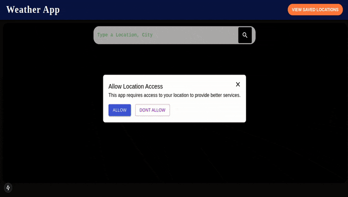

# Weather App

## Table of Contents

- [Weather App](#weather-app)
  - [Table of Contents](#table-of-contents)
  - [Introduction](#introduction)
  - [Features](#features)
  - [Technologies Used](#technologies-used)
  - [Getting Started](#getting-started)
    - [Prerequisites](#prerequisites)
    - [Installation](#installation)
  - [Usage](#usage)
  - [API Integration](#api-integration)
  - [Contributing](#contributing)
  - [License](#license)
  - [Contact](#contact)

## Introduction

Welcome to the Weather App! This application provides real-time weather data for various locations around the world. Users can search for cities and view current weather conditions, forecasts, and more.

<!-- ## Demo

 -->

## Features

- **Real-time Weather Data**: Get up-to-date weather information for any location.
- **Search Functionality**: Easily search for cities by name.
- **Forecasts**: View hourly and daily weather forecasts.
- **User-friendly Interface**: Simple and intuitive design for easy navigation.
- **Save Locations**: Save locations to the database for easy access later on.

## Technologies Used

This project is built using the following technologies:

- **Frontend**: Next.js
- **Backend**: Next.js
- **API**: OpenWeatherMap API, GeoApify API, Open Meteo API
- **Database**: PostgreSQL
- **Styling**: Material UI

## Getting Started

To get a local copy of this project up and running, follow these steps:

### Prerequisites

Make sure you have the following installed:

- Node.js (v14 or later)
- npm (Node package manager)
- PostgreSQL psql

### Installation

1. Clone the repository:

    ```bash
    git clone https://github.com/RoystonDAlmeida/weather-app.git
    ```

2. Navigate to the project directory:

    ```bash
    cd weather-app
    ```

3. Install the dependencies:

    ```bash
    npm install
    ```

4. Create a `.env` file in the root directory and add the following API keys and URLS:

    ```bash
    GEOAPIFY_API_KEY = 
    GEOAPIFY_API_URL = 

    OPENWEATHERMAP_API_KEY = 
    GEOCODING_API_URL = 
    OPENWEATHERMAP_API_URL = 

    NEXT_PUBLIC_RADAR_MAPS_URL = 
    NEXT_PUBLIC_OSM_TILE_URL =
    NEXT_PUBLIC_WEATHER_TILE_URL = 

    OPEN_METEO_API_URL = 

    POSTGRES_DATABASE_URL = 
    ```

5. Start the development server:

    ```bash
    npm run dev
    ```

Your app should now be running on `http://localhost:3000`.

## Usage

1. Open your browser and navigate to `http://localhost:3000`.
2. Enter a city name in the search bar.
3. Click on the search button or press Enter.
4. View the current weather conditions and forecasts displayed on the page.

## API Integration

This app uses the OpenWeatherMap API to fetch weather data. To get your own API key:

1. Go to [OpenWeatherMap](https://openweathermap.org/api).
2. Sign up for an account.
3. Generate an API key from your account dashboard.
4. Replace `OPENWEATHERMAP_API_KEY` in your `.env` file with your actual API key.

This app also uses Geoapify API to get the user coordinates while granting location access. To get your own api key:

1. Go to [Geoapify](https://www.geoapify.com/)
2. Sign up for an account.
3. Generate an API key from the account.
4. Replace `GEOAPIFY_API_KEY` in your `.env` file with the actual Geoapify API key.

## Contributing

We welcome contributions! Here’s how you can help:

1. Fork the repository.

2. Create a new branch:
    ```bash
    git checkout -b feature/YourFeatureName
    ```

3. Make your changes and commit them:
    ```bash
    git commit -m "Add some feature"
    ```

4. Push to your branch:
    ```bash
    git push origin feature/YourFeatureName
    ```

5. Open a pull request.

## License

This project is licensed under the MIT License - see the [MIT LICENSE](https://opensource.org/licenses/MIT) file for details.

## Contact

For any questions or suggestions, feel free to reach out:

- **GitHub**: [RoystonDAlmeida](https://github.com/RoystonDAlmeida)